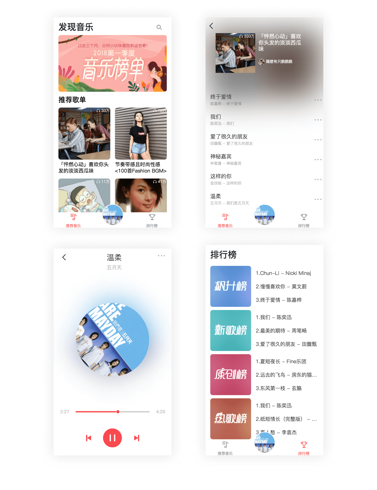

# Vue全家桶实现的iOS 11风格的网易云音乐：
源码地址： [https://github.com/li1xu1bin/NEMusic](https://github.com/li1xu1bin/NEMusic)

# 技术栈：
Vue2 + Vuex + Vue-router + Axios + ES6 + Less

# 运行调试：
``` bash
git clone
npm install
npm run dev
```
# 实现功能：
 - 调用网易云音乐官方的API
 - 推荐音乐和排行榜
 - 歌单详情
 - 播放、切歌
 - 搜索

# 代码结构:
```shell
├── api  //API
│   ├── index.js  //定义方法
│   ├── resource.js  //定义接口
├── assets  //图标资源
├── components  //项目组件
│   ├── music  //推荐和排行榜
│   ├── playlist  //歌单列表
│   ├── public  //公用组件
│       ├── footer.vue //底部栏
│       ├── play-music.vue //播放界面
│   ├── search  //搜索组件
├── router  // 前端路由配置
│   └── index.js
├── store  // vuex数据管理
│   ├── index.js
├── style  //CSS样式
│   └── style.less
├── App.vue // 根组件
└── main.js  // 入口文件
```
 # 部分截图：
   


