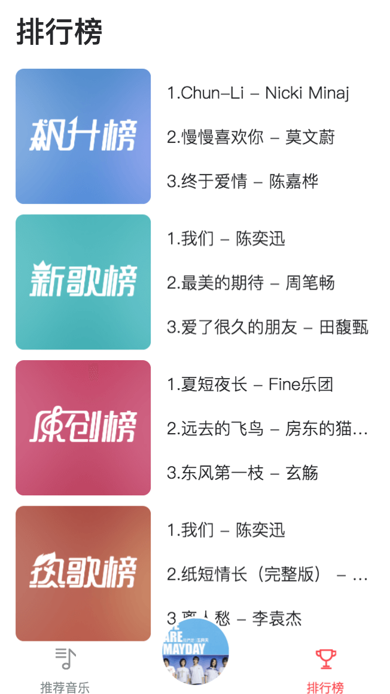
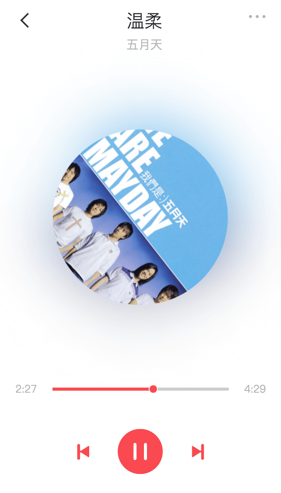

# 介绍：
Vue全家桶实现的iOS 11风格的网易云音乐

# 技术栈：
Vue2 + Vuex + Vue-router + Axios + ES6 + Less

# 调试/构建：
``` bash
npm install
npm run dev
npm run build
```
# 实现功能：
 - 调用网易云音乐官方的API
 - 推荐音乐和排行榜
 - 歌单详情
 - 播放、切歌
 - 搜索

 # 部分截图：
 
 
 
 


